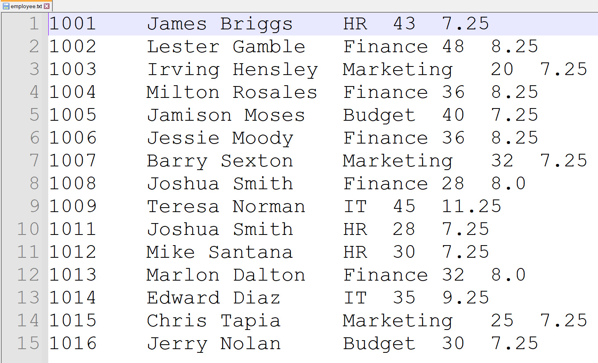
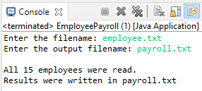
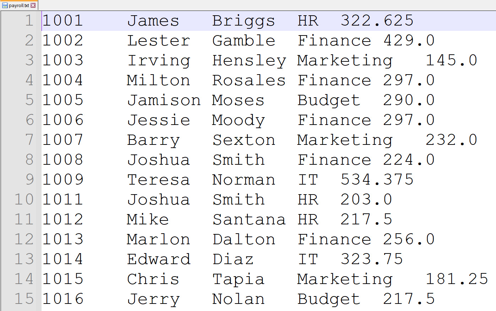

# File of Employees

Webiste: [Click here](https://cristian9217.github.io/cristian9217/courses/COTI3102/)

<b>IDE</b>: Eclipse IDE for Java Developers   

Write a Java program (EmployeePayroll.java) that reads a file of employees (employees.txt) and creates 
another file with their id, full name (first name and last name), departament and weekly salary.

The [code](https://raw.githubusercontent.com/cristian9217/cristian9217/default/courses/COTI3102/java/EmployeePayroll.java)
and [text file](https://raw.githubusercontent.com/cristian9217/cristian9217/default/courses/COTI3102/employee.txt) 
used to read the file of employees. 

Output of the Java Program: 

Output of the File of the employees: 

 

This is program was given has final homework for this course of COTI 3102 - Algorithms and Program Development II.
