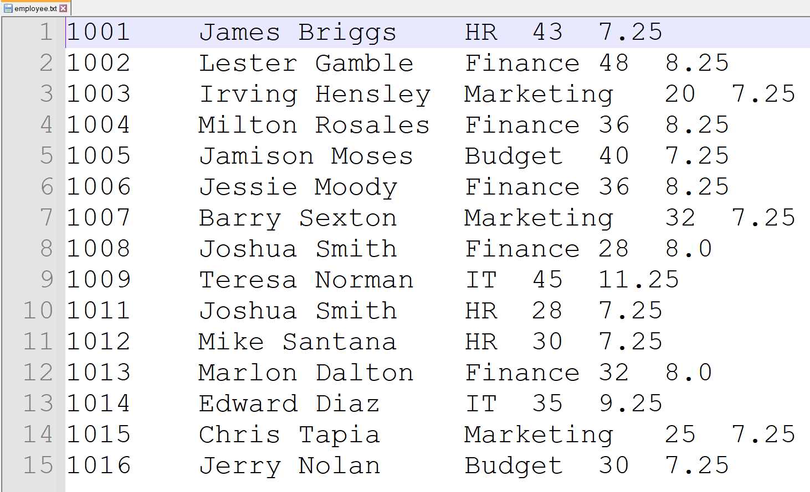
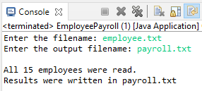

<h1> File of Employees </h1>

<b>IDE</b>: Eclipse IDE for Java Developers   

Write a Java program (EmployeePayroll.java) that reads a file of employees (employees.txt) and creates another file with their id, 
fullname, departament and weekly salary. 

The 
<a href= "https://raw.githubusercontent.com/cristian9217/cristian9217/default/courses/coti3102/java/EmployeePayroll.java">code </a>
and 
<a href= "https://raw.githubusercontent.com/cristian9217/cristian9217/default/courses/coti3102/employee.txt">text file</a> 
used to read the file of employees. 

Output of the Java Program: 

Output of the File of the employees: 

 

This is program was given has final homework for this course of COTI 3102 - Algorithms and Program Development II.
